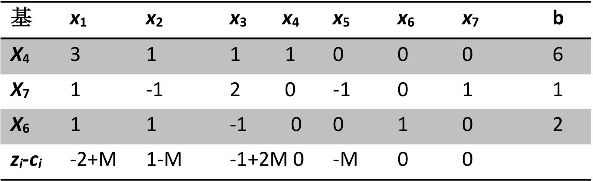
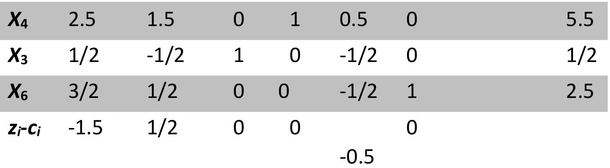
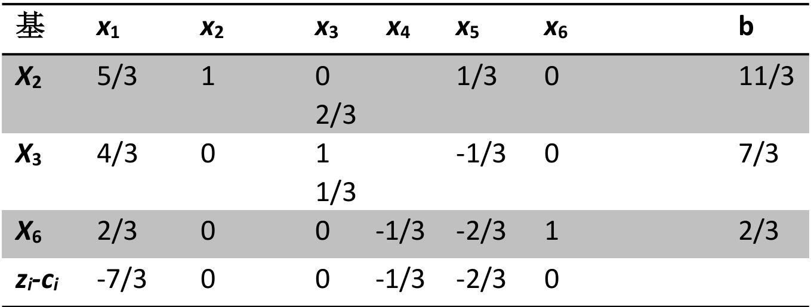
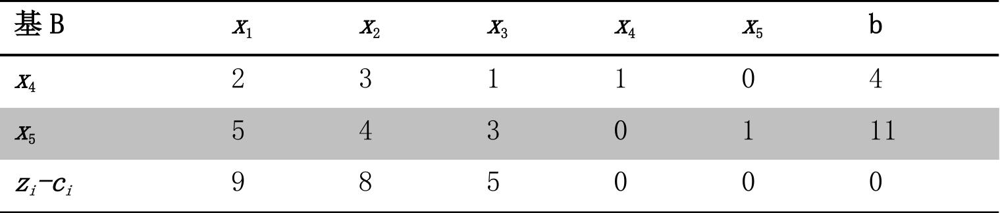
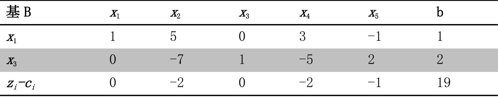
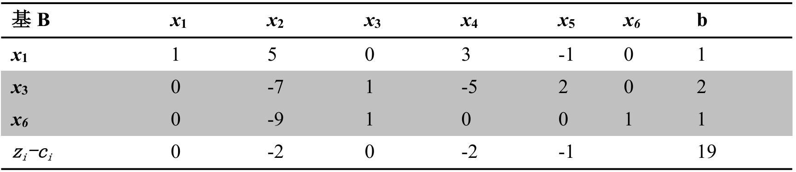
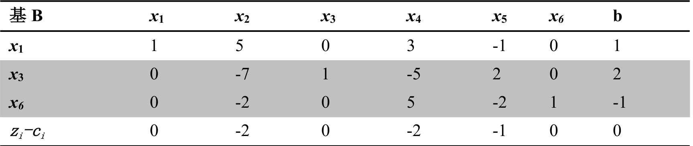
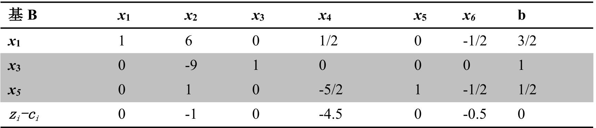

## 

$$
\begin{aligned} {\operatorname* {m i n} \quad} & {{} 2 x_{1}-x_{2}+x_{3}} \\ {\mathrm{s . t .} \quad} & {{} 3 \, x_{1}+x_{2}+x_{3} \leq6} \\ {} & {{} x_{1}-x_{2}+2 \, x_{3} \geq1} \\ {} & {{} x_{1}+x_{2}-x_{3} \leq2} \\ {} & {{} x_{j} \geq0 , \, j=\! 1 , 2 , 3} \\ \end{aligned}
$$

o

(3）若 $X_{1}$ 的系数由 $c_{1}=2$ 改为0，原来的最优解还是新问题的最优解
若目标函数中
吗？

$$
\operatorname* {m i n} \; \; \; 2 x_{_1}-x_{_2}+x_{_3}
$$

$$
\begin{aligned} {\mathrm{s . t . ~}} & {{} \ 3 x_{1}+x_{2}+x_{3}+x_{4}=6} \\ {} & {{} x_{1}-x_{2}+2 x_{3}-x_{5}=1} \\ {} & {{} x_{1} \,+\, x_{2}-x_{3}+x_{6}=2} \\ {} & {{} x_{j} \, \geq\, 0 , \, j=1 , 2 , . . . , 6} \\ \end{aligned}
$$

 $\mathsf{M}$ 弓 $x_{7}$ 

min
$$
\quad2 x_{_{1}} \ -x_{_{2}} \ +\ x_{_{3}} \ \ +\ M x_{_{7}}
$$

$$
\begin{aligned} {\mathrm{s . t .} \quad} & {{} 3 x_{{}_{1}}+x_{{}_{2}}+x_{{}_{3}}+x_{{}_{4}}=6} \\ {} & {{} x_{{}_{1}}-x_{{}_{2}}+2 x_{{}_{3}}-x_{{}_{5}} \!+\! x_{{}_{7}}=\! 1} \\ {} & {{} x_{{}_{1}} \,+\, x_{{}_{2}}-x_{{}_{3}}+x_{{}_{6}}=2} \\ {} & {{} x_{{}_{j}} \geq0 , j=\! 1 , 2 , . . . , 7} \\ \end{aligned}
$$

可 f $x=( \mathbf{0 , 0 , 0 , 6 , 0 , 2 , 1} )^{T}$ J 电纯如

 $x_{3}$ 对应的检验数最大，故 $x_{3}$ 进基，由最小比值原则， $\operatorname* {m i n} \left( 6 / 1 , \, 1 / 2 , \infty\right) \mathbf{=} \mathbf{1 / 2=a}_{2 3} .$ 故 x，离基，进行转轴运算，因 $\mathrm{x} \, 7$ 不是基变量，故可以删去 $\mathrm{x 7}$ 对应的列，得下表

 $x_{2}$ 对应的检验数最大，故 $x_{2}$ 由最小比值原则，min (55/15,
进基
o $\b, 2 . 5 / 1 / 2 , \b=1 1 / 3=\b a_{1 2}$ 故 $x_{4}$ 离基，进行转轴运算，得下表

 $( 2 \, )$ 大贝-

max $6 \mathrm{w}_{\, 1} \,+\, w_{\, 2} \,+2 \, w_{\, 3}$ 

s. $3 \, \boldsymbol{w}_{1} \,+\boldsymbol{w}_{2} \,+\boldsymbol{w}_{3} \, \leq2$ 
$$
\mathrm{w}_{\, 1} \,-\, w_{\, 2} \,+\, w_{\, 3} \, \leq-1
$$
$$
\mathrm{w}_{\, 1} \,+\, 2 \, w_{\, 2} \,-w_{\, 3} \, \leq\! 1
$$
$$
\mathrm{\boldmath~ w ~}_{1} \, \, , \, \mathrm{\boldmath~ w ~}_{3} \, \leq0 , \, \, \mathrm{\boldmath~ w ~}_{2} \, \geq0
$$

3 $\mathbf{c_{1}}$ 营 $\mathbf{x_{1}}$ ， $( z_{1} \!-\! c_{1} )^{\prime}=-7 / 3 \!+2 \!=-1 / 3 ,$ 

初始单纯形表:

现向该线性规划加入新的约束 $- 9 \, \boldsymbol{x}_{2} \,+\, \boldsymbol{x}_{3} \, \leq1$ ，原来的最优解还是最优解吗？如不是，请给出新的最优解

H x6 7

x3

三、若标准型形式的线性规划有一个不是基本可行解的最优解，试证它要么有两个或两个以上的最优基本可行解；要么它至少有一个最优基本可行解，但其一个棱可以无限延伸，即可行域内有一条以该最优基本可行解为顶点的射线

证明：记 $\mathrm{x}$ *为非基本可行解的最优解。不妨设没有两个或两个以上的最优基本可行解，由线性规划的基本性质知道，标准型LP 有最优解必有最优基本可行解， 故至少有一个最优基本可行解 $\mathrm{y}$ *，于是以 $\mathrm{y}$ *为顶点， $\mathrm{y}$ *一 $\mathtt{X}$ *为方向的射线上的可行点都是最优解，因只有一个最优极点，故此射线上没有其它极点，从而该射线上的点都是可行点，即该射线含于可行域内，故证。

DFP o

$$
\operatorname* {m i n} f ( X ) \!=x_{_1}^{2} \,+\, 2 x_{_2}^{_2} \,+\, x_{_1}^{_2} \, ,
$$

4 $x^{( 0 )}=( 2 , 1 )^{T}$ 3 2 O

$$
x^{( 0 )}=\left( \begin{matrix} {2} \\ {1} \\ \end{matrix} \right) , \boldsymbol{H}_{0}=\left( \begin{matrix} {1} & {\ 0} \\ {0} & {\ 1} \\ \end{matrix} \right)
$$

 $\grave{\romannumeral2}$ 

$$
g=\binom{2 x_{1}+1} {4 x_{2}}
$$

 $x^{( 0 )}$ 处的梯度大 $g_{0}=\binom{5} {4}$ 

$$
d^{\left( 0 \right)}=\mathrm{-} \ H_{0} g_{0}={\binom{-5} {-4}}
$$

人 $\mathbf{x}^{( 0 )}$ t 向 $\mathbf{d}^{( 0 )}$ 一 3 $\lambda_{0}$ 

$$
\begin{aligned} {x^{( 0 )}+\lambda d^{( 0 )}=} & {{} \binom2 1+\lambda\binom{-5} {-4}=\binom{2-5 \lambda} {1-4 \lambda}} \\ {\} & {{} \operatorname* {m i n}_{\lambda\geq0} \! f \bigl( x^{( 0 )}+\lambda d^{( 0 )} \bigr)=( 2-5 \lambda)^{2}+2 ( 1-4 \lambda)^{2}+( 2-5 \lambda)} \\ \end{aligned}
$$

1 2 $\lambda_{0}=\allowbreak4 1 / 1 1 4$ 

 $p^{( 0 )}=\lambda_{0} d^{( 0 )}=-\frac{4 1} {1 1 4} \binom{5} {4}$ 
$$
q^{( 0 )}=g_{1}-g_{0}=\Large-\frac{4 1} {1 1 4} \binom{1 0} {1 6}
$$
$$
H_{1}=H_{0}+\cfrac{p^{( 0 )} {p^{( 0 )}}^{T}} {p^{( 0 ) \mathrm{T}} q^{( 0 )}}-\cfrac{H_{0} {q^{( 0 )}} q^{( 0 ) \mathrm{T}} H_{0}} {q^{( 0 ) \mathrm{T}} H_{0} q^{( 0 )}}=\binom{1} {0} \ \ \ \ 0 \ \ \ +\ \cfrac{1} {1 1 4} \binom{2 5} {2 0} \ \ \ \ 2 0 \ \ \ \ \ \ \ \ � \, 1 \ \ \ \ \ \ \ \ \ \ \ \ \ \ \ \ \ \ \ \ \ \ \ \ \ \ \ \ \ \ \ \ \ \ \ \ \ \ \ \ \ \ \ \ \ \ \ \ \ \ \ \ \ \ \ \ \ \ \ \ \ \ \ \ \ \ \ \ \ \ \ \ \ \ \ \ \ \ \ \ \ \ \ \ \ \ \ \ \ \ \ \ \ \ \ \ \ \overbrace{1}^{2 5}
$$

 $==-\frac{1} {8 9} * \frac{4 0} {1 1 4} \binom{4 5 6} {-2 8 5}==-\frac{2 0} {8 9} \binom{8} {-5}$  $= \frac{1} {1 1 4} {\binom{2 5} {2 0}}+\frac{1} {8 9} {\binom{6 4} {-4 0}}$ 
 $d^{( 1 )}=\! \!-H_{1} g_{1}=\! \!-\frac{1} {1 1 4} \binom{2 5} {2 0} \frac{4 0} {1 6} \frac{4 0} {1 1 4} \binom{4} {-5} \!-\frac{1} {8 9} \binom{6 4} {-4 0} \frac{-4 0} {2 5} \frac{4 0} {1 1 4} \binom{4} {-5}$ 

故可令 $d^{\left( 1 \right)}=-\left( \begin{matrix} {8} \\ {-5} \\ \end{matrix} \right)$ 口

求得步长 $\lambda_{1}=\frac{5} {5 7}$ 
 $g_{2}=0 ,$ 故为最优解
五、用可行方向法求解下述优化问题
$$
x^{( 2 )}=x^{( 1 )}+\lambda\ \ d^{( 1 )}=\frac{1} {1 1 4} {2 3 \brack-5 0}+\lambda{-8 \brack5}=\frac{1} {1 1 4} {2 3 \brack-5 0+5 7 0 \lambda}
$$
$$
\operatorname* {m i n}_{\lambda\ge0} f \bigl( x^{( 1 )}+\lambda d^{( 1 )} \bigr)=[ \frac{1} {1 1 4} 2 3-8 \lambda]^{2}+2 [-\frac{5 0} {1 1 4}+5 \lambda]^{2}+( \frac{1} {1 1 4} 2 3-8 \lambda)
$$
$$
x^{( 2 )}=x^{( 1 )}+\lambda_{1} d^{( 1 )}=\left[ \begin{matrix} {{-1 / 2}} \\ {{0}} \\ \end{matrix} \right]
$$

$$
\begin{aligned} {\operatorname* {m i n} \} & {{} f ( x )=x_{1}^{2}+2 x_{2}^{2}+x_{3}^{2}-x_{1} x_{2}+x_{3}} \\ {s . t .} & {{} \ x_{1}+x_{2}+x_{3}=6} \\ {} & {{} \ x_{2} \ \leq2} \\ {} & {{} \ x_{1} , \ \ x_{2} , \ \ x_{3} \geq0} \\ \end{aligned}
$$

 $x_{3}=0$ 早而

min
$$
f ( x )=\boldsymbol{x}_{\i}^{2}+2 \boldsymbol{x}_{\i}^{2} \,-\boldsymbol{x}_{\i} \boldsymbol{x}_{\i}
$$

$$
\begin{aligned} {s . t . \ \ \ x_{_1}+x_{_2} \} & {{}=6} \\ {-x_{_2} \ \} & {{} \geq-2} \\ {x_{_1} , \ \ x_{_2} \geq0} \\ \end{aligned}
$$

可 $\mathrm{x^{\left( 0 \right) T}}=\left( x_{1} , x_{2} , x_{3} \right)=\left( 2 , 2 , 2 \right)$ ,则前庆 3

$$
\nabla f ( \mathrm{x} )={\left( \begin{matrix} {2 x_{1}-x_{2}} \\ {4 x_{2}-x_{1}} \\ {2 x_{3}+1} \\ \end{matrix} \right)} , \nabla f ( \mathrm{x}^{( 0 )} )={\left( \begin{matrix} {2} \\ {6} \\ {5} \\ \end{matrix} \right)} , \mathrm{M}={\left( \begin{matrix} {1} & {1} & {1} \\ {0} & {-1} & {0} \\ \end{matrix} \right)} , A_{2}={\left( \begin{matrix} {1} & {0} & {0} \\ {0} & {1} & {0} \\ {0} & {0} & {1} \\ \end{matrix} \right)}
$$

$$
\mathrm{P}=\mathrm{I}-\mathrm{M}^{\mathrm{T}} ( \mathrm{M} \mathrm{M}^{\mathrm{T}} )^{-1} \mathrm{M}
$$

$$
\begin{aligned} {} & {{}=\biggl( \begin{matrix} {1} & {0} & {0} \\ {0} & {1} & {0} \\ {0} & {0} & {1} \\ \end{matrix} \biggr)-\biggl( \begin{matrix} {1} & {0} \\ {1} & {-1} \\ \end{matrix} \biggr) \biggl( \begin{matrix} {1} & {1} & {1} \\ {0} & {-1} & {0} \\ \end{matrix} \biggl) \biggl( \begin{matrix} {1} & {0} \\ {1} & {-1} \\ {1} & {0} \\ \end{matrix} \biggr) \biggr)^{-1} \bigl( \begin{matrix} {1} & {1} & {1} \\ {0} & {-1} & {0} \\ \end{matrix} \biggr)} \\ {} & {{}=\biggl( \begin{matrix} {1} & {0} & {0} \\ {0} & {1} & {0} \\ {0} & {0} & {1} \\ \end{matrix} \biggr)-\biggl( \begin{matrix} {1} & {0} \\ {1} & {-1} \\ {1} & {0} \\ \end{matrix} \biggr) \bigl( \begin{matrix} {3} & {-1} \\ {-1} & {1} \\ \end{matrix} \bigr)^{-1} \bigl( \begin{matrix} {1} & {1} & {1} \\ {0} & {-1} & {0} \\ \end{matrix} \bigr)} \\ {} & {{}=\biggl( \begin{matrix} {1} & {0} & {0} \\ {0} & {1} & {0} \\ {0} & {0} & {1} \\ \end{matrix} \biggr)-\biggl( \begin{matrix} {1} & {0} \\ {1} & {-1} \\ {1} & {0} \\ \end{matrix} \biggr) \frac{1} {2} \biggl( \begin{matrix} {1} & {1} \\ {1} & {3} \\ \end{matrix} \biggr) \bigl( \begin{matrix} {1} & {1} & {1} \\ {0} & {-1} & {0} \\ \end{matrix} \biggr)} \\ {} & {{}=\biggl( \begin{matrix} {0} & {5} & {0} & {-0 . 5} \\ {0} & {0} & {0} \\ {-0 . 5} & {0} & {0 . 5} \\ \end{matrix} \biggr)} \\ \end{aligned}
$$
$$
\mathrm{d}^{( 0 )}=\mathrm{-~ P} \nabla f ( \mathrm{x}^{( 0 )} )=\left( \begin{matrix} {1 . 5} \\ {0} \\ {-1 . 5} \\ \end{matrix} \right)
$$
$$
x^{( 0 )}+\lambda d^{( 0 )} {=} \binom{2} {2}+\lambda\binom{1 . 5} {0} {-1 . 5}=\binom{2+1 . 5 \lambda} {2}
$$

$$
\begin{aligned} {{\operatorname* {m i n}_{\lambda\ge0}} f \bigl( x^{( 0 )}} & {{}+\lambda d^{( 0 )} \bigr)={\operatorname* {m i n}_{\lambda\ge0}} \varphi( \lambda)} \\ {} & {{}=( 2+1 . 5 \lambda)^{2}+2 \times2^{2}-2 ( 2+1 . 5 \lambda)+( 2-1 . 5 \lambda)^{2}+( 2-1 . 5 \lambda)} \\ {} & {{}=4 . 5 \lambda^{2}-4 . 5 \lambda+1 4} \\ \end{aligned}
$$

$$
\begin{aligned} {b} & {{}=\left( \begin{matrix} {0} \\ {0} \\ {0} \\ \end{matrix} \right)-I \left( \begin{matrix} {2} \\ {2} \\ {2} \\ \end{matrix} \right)=-\left( \begin{matrix} {2} \\ {2} \\ {2} \\ \end{matrix} \right)} \\ {\begin{aligned} {\ddot{u}} & {{}=\left( \begin{matrix} {1 5} \\ {1 . 5} \\ {1 . 5} \\ \end{matrix} \right)} \\ {\dot{u}^{\prime} ( 0 )} & {{}=9 4-\frac{2} {3}} \\ {\dot{u}^{\prime} ( 0 )} & {{}=\frac{2} {3}} \\ {\lambda} & {{}=0 . 5=0} \\ \end{aligned}} \\ {\dot{u}^{\prime} ( 1 )} & {{}=x^{( 0 )}+A d^{( 0 )}=\left( \begin{matrix} {2 . 7 5} \\ {1 . 2 5} \\ \end{matrix} \right)} \\ {\dot{u}^{( 1 )}} & {{}=x^{( 0 )}+A d^{( 0 )}=\left( \begin{matrix} {2 . 7 5} \\ {1 . 2 5} \\ \end{matrix} \right)} \\ {\dot{u}^{( 1 )}} \\ \end{aligned}} \\ {\dot{v}} & {{}=1-\Phi^{\dagger} ( \mathrm{M W}^{T} )^{-1} \mathrm{M}=\left( \begin{matrix} {0 . 5} & {0} & {-0 . 7} \\ {0 . 5} & {0} & {0} \\ {-0 . 5} & {0} & {0 . 5} \\ \end{matrix} \right)} \\ {\dot{u}^{( 1 )}} & {{}=-\mathrm{M} f ( x^{( 1 )} )=\left( \begin{matrix} {0} \\ {0} \\ \end{matrix} \right)} \\ \end{aligned}
$$

$$
\begin{aligned} {\widehat{b}=\left( \begin{matrix} {0} \\ {0} \\ {0} \\ \end{matrix} \right)} & {{}-I \left( \begin{matrix} {2} \\ {2} \\ {2} \\ \end{matrix} \right)=-\left( \begin{matrix} {2} \\ {2} \\ {2} \\ \end{matrix} \right)} \\ {\widehat{d}} & {{}=\left( \begin{matrix} {1 . 5} \\ {0} \\ {-1 . 5} \\ \end{matrix} \right)} \\ {\lambda_{m a x}} & {{}=\frac{4} {3}} \\ {\varphi^{\mathsf{t}} ( \lambda)} & {{}=9 \lambda-4 . 5=0} \\ {\lambda} & {{}=0 . 5} \\ \end{aligned}
$$

$$
\begin{aligned} {\nabla f ( x^{( 0 )} )=\left( \begin{matrix} {3 . 5} \\ {5 . 2 5} \\ {3 . 5} \\ \end{matrix} \right)} & {{}=\frac1 4 {\binom{1 4} {2 . 1}} {\binom{1 4} {1 . 4}} {\mathrm{=}}} \\ {\mathrm{P}} & {{}=\mathrm{I}-\mathrm{M}^{\mathrm{T}} ( \mathrm{M M^{T}} )^{-1} \mathrm{M}=\left( \begin{matrix} {0 . 5} & {0} & {-0 . 5} \\ {0} & {0} & {0} \\ {-0 . 5} & {0} & {0 . 5} \\ \end{matrix} \right)} \\ {\mathrm{d}^{( 1 )}} & {{}=\!-\mathrm{P} \nabla f ( x^{( 1 )} )=\left( \begin{matrix} {0} \\ {0} \\ {0} \\ \end{matrix} \right)} \\ \end{aligned}
$$

 $( \mathrm{M M^{T}} )^{-1} \mathrm{M} \nabla f ( \mathrm{x}^{( 1 )} ) {=} \binom{3 . 5} {-1 . 7 5} ,$ 去掉 $\mathsf{M}$ 中的第一

$$
\begin{aligned} {\mathrm{P=I-M^{T} ( M M^{T} )^{-1} M=}} & {{} \left( \begin{matrix} {1} & {0} & {0} \\ {0} & {1} & {0} \\ {0} & {0} & {1} \\ \end{matrix} \right)-\left( \begin{matrix} {1} \\ {1} \\ {1} \\ \end{matrix} \right) \left( \begin{matrix} {( 1} & {1} & {1 ) \left( \begin{matrix} {1} \\ {1} \\ {1} \\ \end{matrix} \right)} \\ \end{matrix} \right)^{-1} ( 1} & {1} & {1 )} \\ {} & {{}=\frac{1} {3} {\left( \begin{matrix} {2} & {-1} & {-1} \\ {-1} & {2} & {-1} \\ {-1} & {-1} & {2} \\ \end{matrix} \right)}} \\ \end{aligned}
$$

$$
\begin{aligned} {\mathrm{d}^{( 1 )}=} & {{}-\mathrm{P} \nabla f ( x^{( 1 )} )=} & {{}-\frac{1} {3} {\left( \begin{matrix} {-\frac{7} {4}} \\ {\frac{7} {2}} \\ {-\frac{7} {4}} \\ \end{matrix} \right)}} \\ {x^{( 2 )}=} & {{} \ x^{( 1 )}+\lambda d^{( 1 )}=\left( \begin{matrix} {\frac{1 1} {4}} \\ {\frac{4} {5}} \\ {\frac{5} {4}} \\ \end{matrix} \right)-\frac{\lambda} {3} {\left( \begin{matrix} {-\frac{7} {4}} \\ {\frac{7} {2}} \\ {-\frac{7} {4}} \\ \end{matrix} \right)}} \\ \end{aligned}
$$

$$
\begin{aligned} {\operatorname* {m i n}_{\lambda\ge0} f \bigl( x^{( 1 )}} & {{}+\lambda d^{( 1 )} \bigr)=\operatorname* {m i n}_{\lambda\ge0} \varphi( \lambda)} \\ {} & {{}=( \frac{1 1} {4}+\frac{7} {1 2} \lambda)^{2}+2 \times( 2-\frac{7} {6} \lambda)^{2}-( \frac{1 1} {4}+\frac{7} {1 2} \lambda) ( 2-\frac{7} {6} \lambda)} \\ {} & {{}+( \frac{5} {4}+\frac{7} {1 2} \lambda)^{2}+( \frac{5} {4}+\frac{7} {1 2} \lambda)} \\ {} & {{} \qquad\qquad\varphi^{\prime} ( \lambda)=0} \\ {} & {{} \qquad\lambda=\frac{1} {4}} \\ \end{aligned}
$$

 $\geq0$ 中 JKKT点,
V

注意到 $\nabla^{2} f ( \mathrm{x} )=\left( \begin{matrix} {2} & {-1} & {\ 0} \\ {-1} & {4} & {\ 0} \\ {0} & {0} & {\ 2} \\ \end{matrix} \right)$ 正定：目标函数是凸函数，约京是线性约束，故为最优解。

预足火

$$
\begin{aligned} {} & {{} \operatorname* {m i n}} & {x_{1}^{2}+x_{2}^{2}} \\ {} & {{} \mathrm{s . t .}} & {\big( x_{1}-1 \big)^{3}-x_{2}^{2} \,=0} \\ \end{aligned}
$$

口
\

O 早
D 9

(3) H $x_{2}^{2} \mathrm{=(} x_{1}-1 \mathrm{)}^{3}$ 早预
沙

$$
\textsc{m i n} ~ x_{1}^{2}+( x_{1}-1 )^{3}
$$

马？ V月 O

(4) 大见 o

名 $\lambda=0$  ${\binom{2 \mathrm{x}_{1}} {2 \mathrm{x}_{2}}} \! \!+\! {\mu} {\binom{3 ( \mathrm{x}_{1}-1 )^{2}} {-2 \mathrm{x}_{2}}} \! \!=\! {\bf0}$  $\nabla f ( \mathrm{x} )=\binom{2 \mathrm{x}_{1}} {2 \mathrm{x}_{2}} , \, \, \, \nabla g ( \mathrm{x} )=\binom{3 ( \mathrm{x}_{1}-1 )^{2}} {-2 \mathrm{x}_{2}}$ 
解：（1）
: $\mu\neq0$ .m $\binom{\mathrm{X_{1}}} {\mathrm{X_{2}}} {=\binom{1} {\mathrm{0}}}$ 
若 $\lambda\neq0$ ，则方程可化简为
 $\binom{2 \mathrm{x}_{1}} {2 \mathrm{x}_{2}} \! \!+\! \mu\binom{3 ( \mathrm{x}_{1}-1 )^{2}} {-2 \mathrm{x}_{2}} \! \!=\! \mathrm{0}$  $( 1-\mu) \mathrm{x_{2}=0}$  $\mathbf{x_{2}=O}$ u=1 则 $3 ( \mathrm{x}_{1}-1 )^{2} \mathrm{+} 2 \mathrm{x}_{1} \mathrm{=} \mathrm{0} ,$ 。但此方程无实根，故无解。

 $\mathsf{F J} \not\supset$  $\ \%$  $\mathbf{x_{2}=O}$ 则 $\mathrm{g ( x )=0}$ 知 $\mathrm{x_{1}=1}$ 但 $3 \mu( \mathrm{x}_{1}-1 )^{2} \mathrm{+} 2 \mathrm{x}_{1} \mathrm{=2}$ F o

J 小 1,0

KI
小

界。补救措施。加上条件 $( x_{1}-1 )^{3} \geq0$ ，也即 $( x_{1}-1 )^{3} \geq0$ 南家大馆 (3)
 $x_{1} \geq1$ ,

(4)

$$
\theta( \mu)=\operatorname* {m i n} \{\mathrm{x}_{1}^{2}+\mathrm{x}_{2}^{2}+\mu( ( \mathrm{x}_{1}-1 )^{3}-\mathrm{x}_{2}^{2} ) \}=\left\{\begin{aligned} {} & {{}-\infty\, , \; \; \mu\neq0} \\ {} & {{} 0 \, , \; \; \mu=0} \\ \end{aligned} \right.
$$

其卡见 $\operatorname* {m a x} \theta( \mu)=0$ 